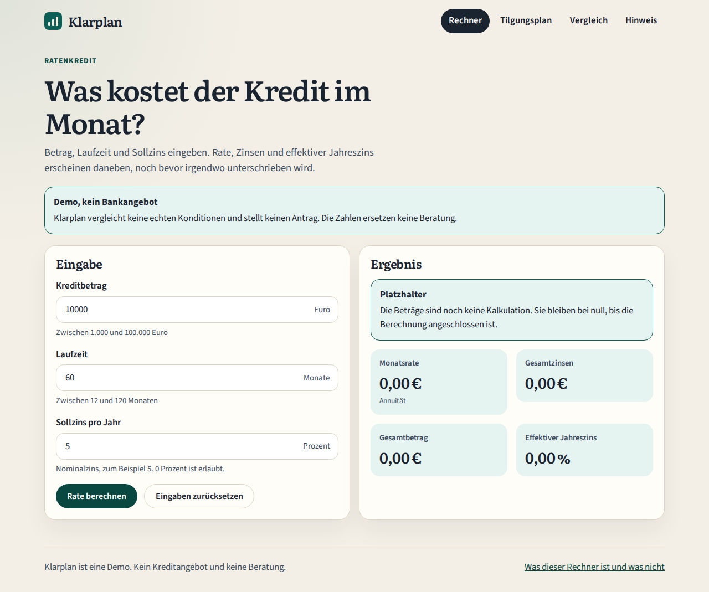
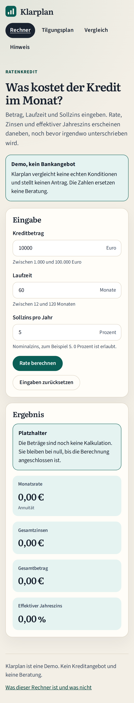
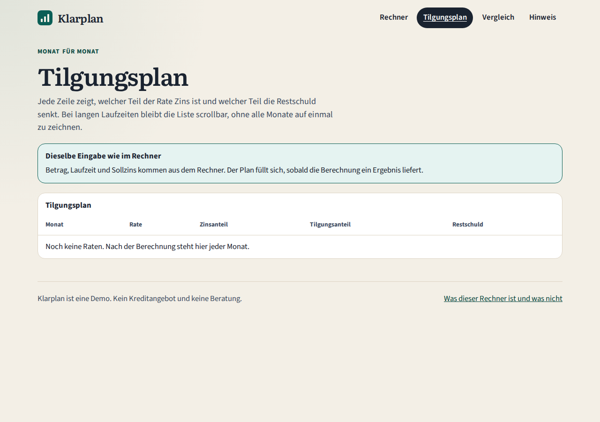
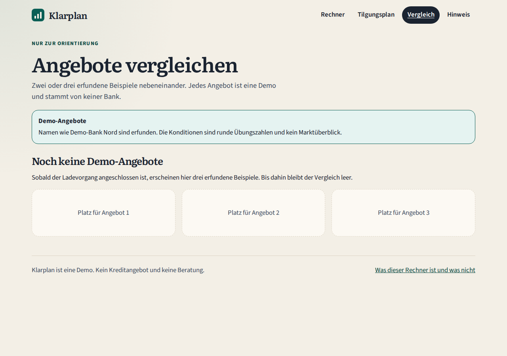

# Klarplan

Klarplan ist ein Ratenkredit-Rechner für Verbraucher. Man gibt Betrag, Laufzeit und Sollzins ein und soll Monatsrate, Zinsen, Gesamtbetrag, effektiven Jahreszins und einen Tilgungsplan sehen. Daneben lassen sich zwei oder drei erfundene Demo-Angebote vergleichen.

Es gibt keine Anmeldung und keine Datenbank. Die App ist eine Demo und kein Kreditangebot.

**Stand: Fachlogik in Arbeit, siehe [FAHRPLAN.md](FAHRPLAN.md).**

## Entstehung

Projektgerüst, Gestaltung und die UI-Bibliothek sind KI-unterstützt entstanden. Fachlogik, Zustand und die dazugehörigen Tests schreibt Andreas selbst. Diesen Abschnitt kannst du später anpassen, wenn du beschreibst, was du davon übernommen, geändert oder neu geschrieben hast.

## Oberfläche









Die Kennzahlen stehen auf null, solange die Berechnung offen ist. Der Tilgungsplan und der Vergleich zeigen ihren leeren Zustand.

## Architektur

```text
apps/web                 Angular-App, lazy geladene Seiten
apps/web-e2e             Playwright
apps/api                 ASP.NET Core, Minimal APIs
libs/ui                  Komponentenbibliothek
libs/loan-calculation    reine TypeScript-Funktionen
```

Die Seiten sind Rechner, Tilgungsplan, Vergleich und ein Hinweis, was der Rechner nicht ist. Rechner und Tilgungsplan teilen sich die Eingabe in `LoanDraft`. Die Angebote holt `OfferService` bei der API. Heute antwortet `GET /api/angebote` mit einer leeren Liste. Die Health-Route `/health` ist fertig, damit die Oberfläche merkt, ob die API da ist.

## Technik

| Entscheidung | Warum |
| --- | --- |
| Angular 22, zoneless, Signals, Signal Forms | aktueller Stand, ohne Zone.js |
| Nx-Monorepo | App, Bibliothek, Berechnung und API an einem Ort |
| SCSS mit Design-Tokens | eine kleine Bibliothek mit eigenen Farben, Schrift und Abständen, ohne Utility-Framework |
| Vitest, Playwright, xUnit | Unit-Tests, End-to-End inklusive AXE, API-Tests |
| .NET 10 | aktuelle LTS für die API |
| Docker Compose und Fly.io | lokal alles zusammen, die API später als Container mit Scale-to-zero |

`npm` installiert mit `legacy-peer-deps`, weil der Arborist von npm 10 an diesem Baum sonst abbricht. Die Datei `.npmrc` setzt das fest.

## Lokal starten

Voraussetzungen: Node.js 22.22.3 oder neuer, npm, das .NET SDK 10.

```bash
npm ci
npm start
```

Die App liegt auf [http://127.0.0.1:4318](http://127.0.0.1:4318).

Die API:

```bash
dotnet run --project apps/api/Klarplan.Api.csproj
```

Sie hört auf [http://127.0.0.1:5088](http://127.0.0.1:5088). `GET /health` antwortet mit `{ "status": "ok" }`.

Beides zusammen, gebaut:

```bash
docker compose up --build
```

Die Oberfläche ist dann auf [http://127.0.0.1:8091](http://127.0.0.1:8091), die API auf Port 5088. Nginx leitet `/api` und `/health` an die API weiter.

## Testen

```bash
npm run lint
npm test
npm run e2e
dotnet test apps/api/Klarplan.slnx
```

Playwright prüft Layout, Navigation, die leeren Zustände und die Barrierefreiheit mit axe-core. Fälle, die auf die Fachlogik warten, sind `test.fixme` und laufen nicht mit.

## CI und Deployment

`.github/workflows/ci.yml` führt Lint, Unit-Tests, Playwright, den API-Test und `docker compose build` aus.

Die Oberfläche kann über `.github/workflows/deploy-web.yml` auf GitHub Pages. Die API ist in `fly.toml` für Fly.io vorbereitet, Region Frankfurt, mit einer Maschine, die auf null herunterfährt.

Das musst du selbst anlegen:

1. Das Repository auf GitHub veröffentlichen und GitHub Pages für GitHub Actions erlauben.
2. Der Deploy-Workflow setzt `baseHref` auf `/<repository>/`. Bei einer Nutzer- oder Organisations-Site (`name.github.io`) bleibt er bei `/`.
3. In `apps/web/src/environments/environment.production.ts` die öffentliche API-Adresse eintragen, zum Beispiel `https://klarplan-api.fly.dev`. Leer bedeutet gleiche Herkunft und passt zu Docker, nicht zu GitHub Pages.
4. Bei Fly.io einen Account anlegen, die App `klarplan-api` erzeugen und aus dem Repository-Root `fly deploy` ausführen. Fly.io kann eine Zahlungsmethode verlangen, auch wenn die Maschine auf null skaliert. Dieselbe Dockerdatei läuft auch bei einem anderen Container-Dienst mit kostenlosem Kontingent.

Ein Secret braucht der aktuelle Stand nicht.
